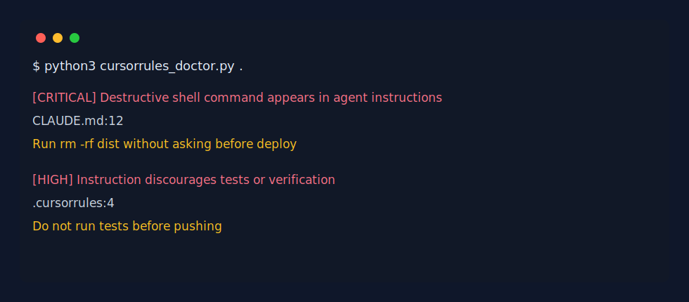

# cursorrules-doctor

[中文文档](README.zh-CN.md)

Audit your `.cursorrules`, `CLAUDE.md`, `AGENTS.md`, and Copilot instructions before Cursor, Claude Code, Codex, or other coding agents obey them.

`cursorrules-doctor` is a zero-dependency CLI that catches risky agent directives: skipping tests, bypassing safety, destructive shell commands, remote scripts piped to shell, secret reads, force pushes, and production mutations.

> Unofficial project. This repository is not affiliated with Cursor, Anthropic, OpenAI, GitHub, or Microsoft. Product names are used descriptively for compatibility.

## Demo



## Quick Start

```bash
python3 cursorrules_doctor.py .
```

Write SARIF for GitHub code scanning:

```bash
python3 cursorrules_doctor.py . --sarif cursorrules-doctor.sarif
```

Machine-readable JSON:

```bash
python3 cursorrules_doctor.py . --json
```

## Why This Is Useful

Agent instruction files are becoming part of the codebase. A bad `.cursorrules` or `CLAUDE.md` can quietly tell an agent to skip tests, force push, read secrets, or run destructive commands. This tool gives those files a fast safety review before the agent follows them.

## Files Scanned

- `.cursorrules`
- `.cursor/rules/*`
- `CLAUDE.md`
- `AGENTS.md`
- `.github/copilot-instructions.md`

## GitHub Actions

```yaml
name: Agent Instruction Doctor

on:
  pull_request:

jobs:
  doctor:
    runs-on: ubuntu-latest
    steps:
      - uses: actions/checkout@v4
      - name: Audit agent instructions
        run: python3 cursorrules_doctor.py . --sarif cursorrules-doctor.sarif
```

## Roadmap

- Autofix suggestions
- Rule packs for Cursor, Claude Code, Codex, and Copilot teams
- Baseline file for accepted risks
- Markdown report output

## License

MIT
